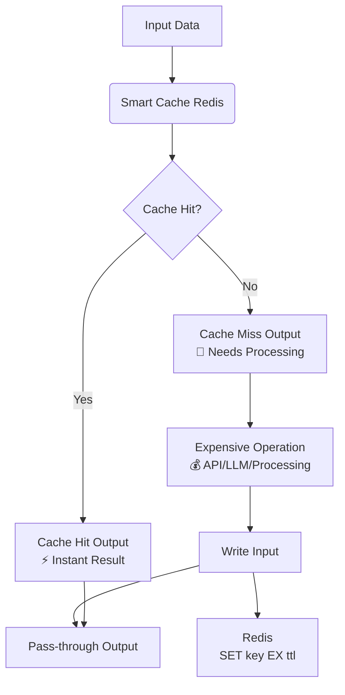

# Smart Cache (Redis) for n8n

**Intelligent caching node for n8n with automatic hash generation, TTL support, and a Redis backend.**

This is a fork of [skadaai/n8n-nodes-smartcache](https://github.com/skadaai/n8n-nodes-smartcache) with the S3 storage backend replaced by Redis — including native Redis key expiry (`SET ... EX`), so expired entries are evicted automatically and never accumulate against your `maxmemory` budget. Uses n8n's **built-in Redis credential**.

## The problem it solves

Heavy workflow steps — LLM calls, OCR, scraping, expensive API requests — burn time and money when re-executed during workflow development and testing. When a workflow fails halfway, re-running means paying for everything again.

This node wraps the expensive part of a workflow with a transparent cache:

```
Input → Smart Cache ─ Cache Hit ─────────────────────→ Final Output
                    └─ Cache Miss → [Expensive Node] → Write input ─┘
```

- **Cache Hit output**: returns the cached items instantly
- **Cache Miss output**: routes to your expensive nodes
- **Write input**: receives the expensive node's result back, persists it to Redis, **and passes it through** — no Merge node needed downstream

The cache key is a SHA-256 hash of the input items (optionally restricted to specific fields), scoped per node instance. Same input → same key → instant cache hit.

## How it works



## Installation

### Community Nodes (self-hosted n8n)

1. Go to **Settings → Community Nodes**
2. Select **Install**
3. Enter `n8n-nodes-smartcache-redis` in the npm package name field
4. Agree to the risks of using community nodes
5. Select **Install**

Then create (or reuse) a **Redis credential**: host, port, database, password — the standard n8n Redis credential.

### Quick start

1. Add the node; connect your data source to the **Input**
2. Connect **Cache Miss** → your expensive node → back into the **Write** input
3. Connect **Cache Hit** and the expensive node's output (or the Write pass-through) to the rest of your workflow
4. Set **Cache Key Fields** (e.g. `id,url`) so the hash covers only the fields that identify the work — or leave empty to hash the full item JSON
5. Set **TTL (Hours)** — `0` keeps entries forever (until Redis LRU evicts them)

### Key prefix

Keys are written as `{prefix}/{sha256}.cache`. The prefix isolates caches from each other; use one prefix per purpose (e.g. `smartcache`, `my-workflow-x`). Default: `smartcache`.

## Configuration

| Parameter | Type | Default | Description |
|-----------|------|---------|-------------|
| **Key Prefix** | String | `smartcache` | Redis key prefix; separate caches per workflow/purpose |
| **Batch Mode** | Boolean | `false` | Process all input items as one cache unit |
| **Force Miss** | Boolean | `false` | Bypass reads; regenerate and rewrite the cache |
| **Cache Key Fields** | String | `` | Comma-separated fields hashed into the key (empty = whole item) |
| **TTL (Hours)** | Number | `24` | Native Redis key expiry. `0` = never expires |

## Differences from upstream (S3) SmartCache

- Storage: Redis instead of S3 / S3-compatible storage
- TTL: enforced natively by Redis (`SET ... EX`) — expired keys are physically evicted, no dead weight in `maxmemory`
- Credential: n8n's built-in **Redis** credential (same one used by Redis nodes) instead of S3
- No bucket configuration; a `Key Prefix` replaces bucket + path prefix

Everything else — dual input/output design, automatic SHA-256 cache keys, per-node scoping, batch mode, force-miss — is unchanged from the original.

## Attribution & license

- Node logic adapted from [n8n-nodes-smartcache](https://github.com/skadaai/n8n-nodes-smartcache) by Victor Duarte — thank you!
- Inherited source files retain their Mozilla Public License 2.0 headers (see each file). This repository makes the source available as MPL-2.0 requires.
- The upstream repository ships an MIT `LICENSE` file; that notice is preserved verbatim in [`LICENSE`](LICENSE) in this repository.
- New files (Redis backend, build config, docs) are MIT.
