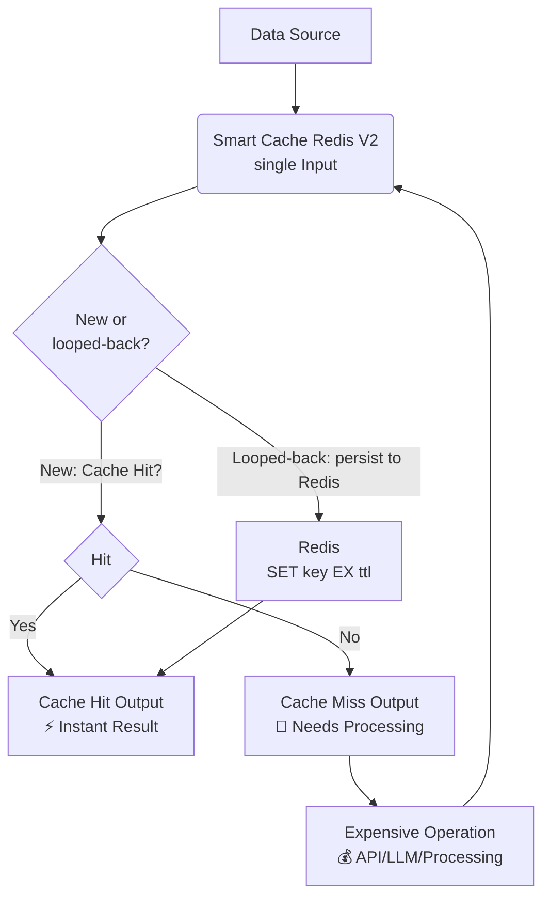
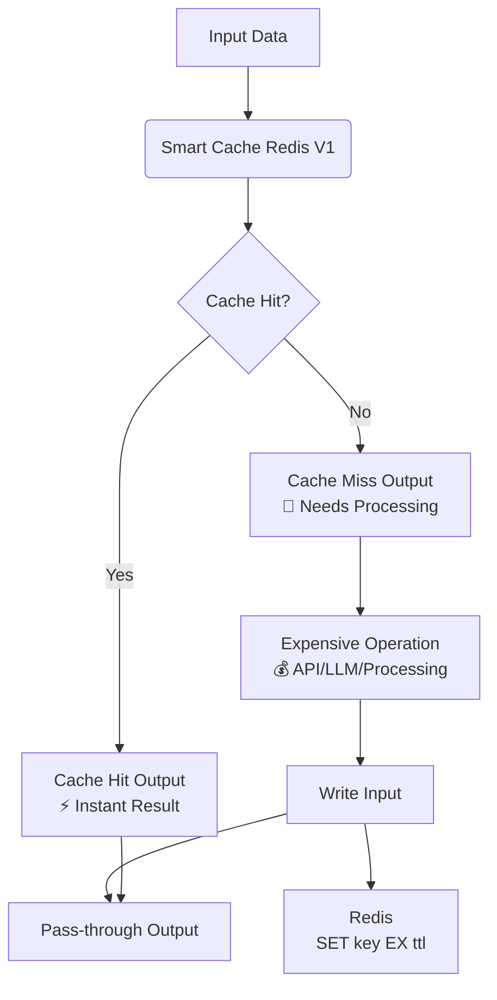

# Smart Cache (Redis) for n8n

**Intelligent caching node for n8n with automatic hash generation, TTL support, and a Redis backend.**

This is a fork of [skadaai/n8n-nodes-smartcache](https://github.com/skadaai/n8n-nodes-smartcache) with the S3 storage backend replaced by Redis — including native Redis key expiry (`SET ... EX`), so expired entries are evicted automatically and never accumulate against your `maxmemory` budget. Uses n8n's **built-in Redis credential**.

## The problem it solves

Heavy workflow steps — LLM calls, OCR, scraping, expensive API requests — burn time and money when re-executed during workflow development and testing. When a workflow fails halfway, re-running means paying for everything again.

This node wraps the expensive part of a workflow with a transparent cache:

```
Input → Smart Cache ─ Cache Hit ─────────────────────→ Final Output
                    └─ Cache Miss → [Expensive Node] → Write input ─┘
```

- **Cache Hit output**: returns the cached items instantly
- **Cache Miss output**: routes to your expensive nodes
- **Write input**: receives the expensive node's result back, persists it to Redis, **and passes it through** — no Merge node needed downstream

The cache key is a SHA-256 hash of the input items (optionally restricted to specific fields), scoped per node instance. Same input → same key → instant cache hit.

## Node versions: V1 vs V2

This node ships as a **versioned node** (`typeVersion` 1 and 2). n8n resolves each workflow's saved `typeVersion` to its own code — existing workflows keep running whichever version they were built on, forever, with zero behavior change, even after this package updates. New nodes default to **V2**.

- **V1 (`typeVersion` 1)** — the original **dual-input** design (separate `Input` and `Write` slots). Kept exactly as it has always behaved, for existing production workflows pinned to it. **Do not use V1 for new workflows** — see the warning below.
- **V2 (`typeVersion` 2, default)** — the current **single-input** design. Functionally equivalent (same Cache Hit / Cache Miss outputs, same parameters, same Redis storage format) but fixes a real bug in how V1's two inputs interact with n8n's execution engine.

### Why V1 is broken for the documented loop-back wiring

V1 declares two "main" input slots (`Input`, `Write`). n8n's execution engine treats **any node with more than one declared main input** as a join/barrier: it won't run the node until data (or an explicit "unreachable" signal) has arrived on *every* input. But V1's own documented usage wires `Write`'s only source **downstream of the node's own Cache Miss output** — a genuine cycle. For `executionOrder: 'v1'` workflows (n8n's modern default), the engine can never resolve that wait, so **the node silently never executes** — and everything wired only through it is dropped, with the run still reporting "success". This is a bug in the dual-input design itself, not a wiring mistake; there is no working way to wire V1 as documented on a modern-default workflow.

**If you are starting a new workflow, use V2.** V1 stays in the package only so already-deployed workflows keep running unmodified while they're migrated at their own pace.

## How it works

### V2 (typeVersion 2, default) — single input

Both the original data source **and** the downstream expensive node's result wire into the **same single `Input` anchor** — n8n supports multiple incoming wires converging on one input index (the same pattern n8n's own "Loop Over Items" node uses to loop into itself). There's no separate "Write" slot, so there's no join/barrier and no cycle for the engine to get stuck on.

```
                    ┌─────────────────────────────────────────┐
                    │                                          │
                    ▼                                          │
Data Source ──▶ Smart Cache ─ Cache Hit ────────────────▶ Final Output
                    └─ Cache Miss ──▶ [Expensive Node] ────────┘
```

- On each call, items arriving on `Input` are split **in-band** (by a `pending` flag the node stores per item, not by which wire they came in on) into: items still awaiting write-back (looped back from the expensive node — persisted to Redis and passed through on **Cache Hit**) and genuinely new items (checked against the cache; hits go to **Cache Hit**, misses go to **Cache Miss** and are flagged pending until they loop back).
- **Cache Hit output**: cached items (instant) plus write-backs just persisted, passed straight through
- **Cache Miss output**: routes to your expensive node; wire its result back into the **same `Input`**



### V1 (typeVersion 1) — dual input (legacy, existing workflows only)

```
Input → Smart Cache ─ Cache Hit ─────────────────────→ Final Output
                    └─ Cache Miss → [Expensive Node] → Write input ─┘
```

- **Cache Hit output**: returns the cached items instantly
- **Cache Miss output**: routes to your expensive nodes
- **Write input**: receives the expensive node's result back, persists it to Redis, **and passes it through** — no Merge node needed downstream



> As covered above, this dual-input wiring cannot actually complete on a modern-default (`executionOrder: 'v1'`) workflow — the diagram documents V1's historical design, not a working new setup. It's kept here only so anyone still on V1 recognizes their existing wiring.

## Installation

### Community Nodes (self-hosted n8n)

1. Go to **Settings → Community Nodes**
2. Select **Install**
3. Enter `n8n-nodes-smartcache-redis` in the npm package name field
4. Agree to the risks of using community nodes
5. Select **Install**

Then create (or reuse) a **Redis credential**: host, port, database, password — the standard n8n Redis credential.

### Quick start (V2, default)

1. Add the node (it starts on V2); connect your data source to the **Input**
2. Connect **Cache Miss** → your expensive node → its output back into the **same `Input`** (the one wire anchor now carries both the original data and the loop-back)
3. Connect **Cache Hit** to the rest of your workflow
4. Set **Cache Key Fields** (e.g. `id,url` or `user.id` for nested fields) so the hash covers only the fields that identify the work — or leave empty to hash the full item JSON
5. Set **TTL (Seconds)** — `0` keeps entries forever (until Redis LRU evicts them)

### V1 quick start (legacy — existing workflows only, do not use for new ones)

1. Connect your data source to the **Input**
2. Connect **Cache Miss** → your expensive node → back into the **Write** input
3. Connect **Cache Hit** and the expensive node's output (or the Write pass-through) to the rest of your workflow
4. Set **Cache Key Fields** and **TTL (Seconds)** as above

### Key prefix

Keys are written as `{prefix}/{sha256}.cache`. The prefix isolates caches from each other; use one prefix per purpose (e.g. `smartcache`, `my-workflow-x`). Default: `smartcache`.

## Configuration

| Parameter | Type | Default | Description |
|-----------|------|---------|-------------|
| **Key Prefix** | String | `smartcache` | Redis key prefix; separate caches per workflow/purpose |
| **Batch Mode** | Boolean | `false` | Process all input items as one cache unit |
| **Force Miss** | Boolean | `false` | Bypass reads; regenerate and rewrite the cache |
| **Cache Key Fields** | String | `` | Comma-separated fields hashed into the key, dot notation supported for nested fields (empty = whole item) |
| **TTL (Seconds)** | Number | `86400` | Native Redis key expiry. `0` = never expires |

## Differences from upstream (S3) SmartCache

- Storage: Redis instead of S3 / S3-compatible storage
- TTL: enforced natively by Redis (`SET ... EX`) — expired keys are physically evicted, no dead weight in `maxmemory`
- Credential: n8n's built-in **Redis** credential (same one used by Redis nodes) instead of S3
- No bucket configuration; a `Key Prefix` replaces bucket + path prefix

Everything else — dual input/output design, automatic SHA-256 cache keys, per-node scoping, batch mode, force-miss — is unchanged from the original.

## Attribution & license

- Node logic adapted from [n8n-nodes-smartcache](https://github.com/skadaai/n8n-nodes-smartcache) by Victor Duarte — thank you!
- Inherited source files retain their Mozilla Public License 2.0 headers (see each file). This repository makes the source available as MPL-2.0 requires.
- The upstream repository ships an MIT `LICENSE` file; that notice is preserved verbatim in [`LICENSE`](LICENSE) in this repository.
- New files (Redis backend, build config, docs) are MIT.
